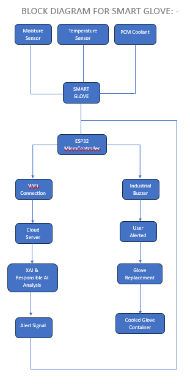
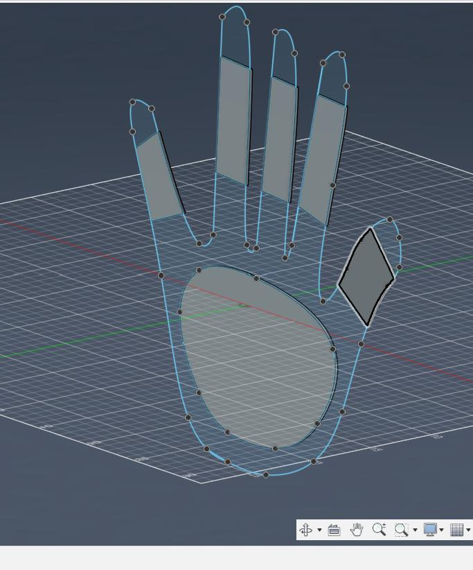
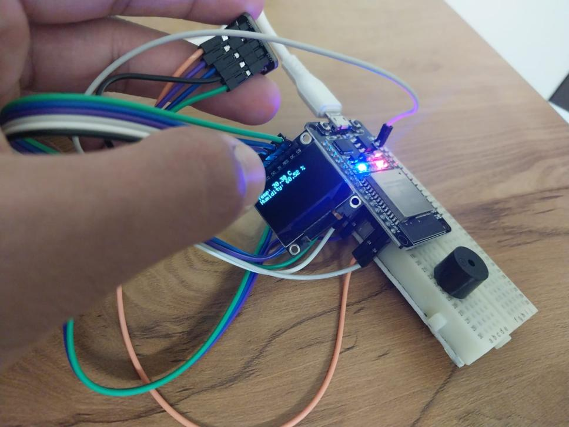
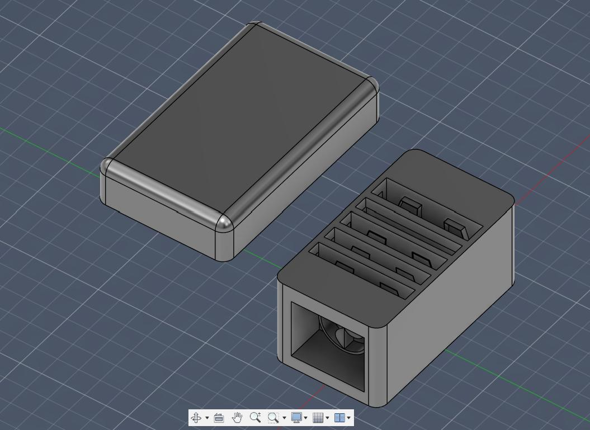
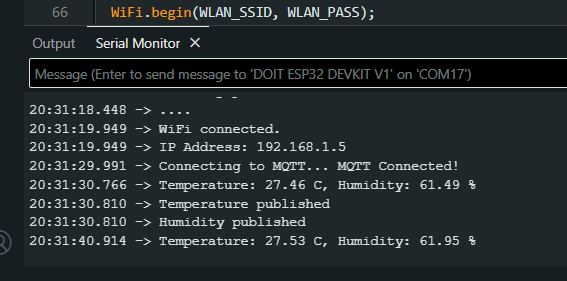
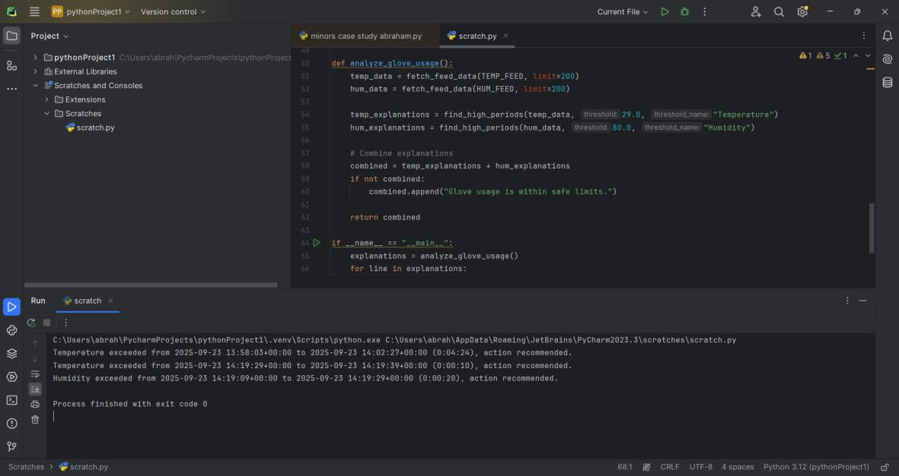
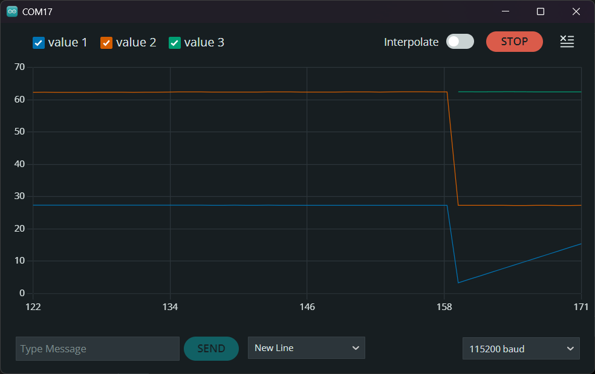

# AI-based E-Waste Smart Glove ♻️🧤

An **Explainable AI (XAI)-driven** IoT wearable system designed to enhance worker safety during e-waste handling — combining real-time environmental sensing, passive thermal regulation, and transparent AI-driven insights for plant supervisors.

📄 Developed as a Capstone Project (MICSAI785) — Department of AI, ML & Data Science, B.Tech Mechanical Engineering with Minors in AI, CHRIST (Deemed to be University), Bengaluru — September 2025.



## 🎯 Problem
E-waste workers operate in environments where prolonged glove use traps heat and sweat, leading to skin rashes, fungal infections, and fatigue. There is currently no system that alerts workers when internal glove conditions become hazardous, and supervisors have no way to remotely monitor worker safety at scale.

## 💡 Solution
The Smart Glove is embedded with temperature and humidity sensors that continuously monitor the internal glove environment, alerts the wearer locally via an OLED display and buzzer, and streams data to the cloud. A passive **Phase Change Material (PCM)** cooling system regulates temperature without consuming power. On the backend, an **Explainable AI (XAI)** layer — SHAP & LIME — makes the system's safety insights transparent and interpretable for plant supervisors, rather than a black-box alert.

## 🏗️ System Architecture

**1. Edge Device (Glove)**
- HTU21D-F sensor reads temperature & humidity
- SSD1306 OLED display shows live readings to the wearer
- Piezo buzzer provides immediate audible alerts (temp > 29°C or humidity > 80%)
- ESP32 (DFRobot Beetle ESP32-C6 Mini) handles sensing, display, and connectivity
- Passive PCM cooling pouches integrated into the palm and finger sections

**2. Connectivity**
- ESP32 connects to WiFi and publishes sensor data via **MQTT**

**3. Backend Processing & Analytics** — two layers, both implemented:
- **Rule-based threshold detection** *(currently deployed)* — flags time periods where readings exceed safe limits and recommends action (`backend/analyze_glove_usage.py`)
- **Explainable AI layer** *(SHAP + LIME)* — trains Random Forest regressors on sensor trends and explains which features (time of day, recent readings) drive them (`backend/analysis_shap_lime.py`)

**4. Visualization**
- Real-time IoT dashboard (currently Adafruit IO) for live monitoring
- SHAP summary plots and LIME instance explanations for supervisor-facing insight

> **Current implementation vs. target architecture:** The working prototype uses **Adafruit IO** as the cloud broker/dashboard. The report's target architecture is **HiveMQ + TimescaleDB** for the cloud layer and **LightGBM** for low-latency heat stress prediction — planned upgrades as the project matures beyond prototype stage.

## 🛠️ Hardware
| Component | Purpose |
|---|---|
| DFRobot Beetle ESP32-C6 Mini | Main microcontroller — sensing, display, buzzer, WiFi/MQTT |
| HTU21D-F Sensor | Temperature & moisture sensing |
| SSD1306 OLED Display | Real-time readout for the wearer |
| Piezo Buzzer | Audible safety alerts (temp > 29°C or humidity > 80%) |
| 3.7V LiPo Battery | Portable power source |
| TP4056 Module | Battery charging management |
| PCM (Phase Change Material) pouches | Passive cooling, melting point tuned near skin temperature (~32–35°C) |

## 🧠 Software & AI Stack
- **Firmware:** ESP32 (Arduino/C++) — sensor reading, OLED display, WiFi & MQTT publishing to Adafruit IO
- **Backend:** Python — Adafruit IO REST API client, pandas for data prep
- **ML Models:** scikit-learn `RandomForestRegressor` (temperature & humidity trend prediction)
- **Explainability:** SHAP, LIME *(core differentiator of the project)*
- **Visualization:** matplotlib, Adafruit IO dashboard

## 📁 Repository Structure
```
├── firmware/
│   ├── smart_glove.ino          # ESP32 firmware — sensors, OLED, buzzer, MQTT
│   └── config.example.h         # Copy to config.h and add your credentials
├── backend/
│   ├── analyze_glove_usage.py   # Rule-based threshold detection (deployed)
│   ├── analysis_shap_lime.py    # SHAP/LIME explainable AI analysis
│   ├── requirements.txt         # Python dependencies
│   └── .env.example             # Copy to .env and add your credentials
├── hardware/
│   └── cad/
│       ├── PCM_GLOVE.stl        # 3D model — glove with PCM coolant layout
│       └── cooling_chamber.stl  # 3D model — standalone PCM cooling chamber
├── docs/
│   ├── Capstone_Report.pdf      # Full project report
│   └── images/                  # Figures: CAD renders, hardware, dashboard, results
├── .gitignore
└── README.md
```

## 🧩 Hardware / CAD Files
The actual 3D-printable/editable CAD models are available in [`hardware/cad/`](hardware/cad/):
- [`PCM_GLOVE.stl`](hardware/cad/PCM_GLOVE.stl) — glove body with PCM coolant pouch layout across the palm and fingers
- [`cooling_chamber.stl`](hardware/cad/cooling_chamber.stl) — standalone PCM cooling/drying chamber for post-use glove sanitation

These are STL files and can be opened in any free STL viewer (e.g. [viewstl.com](https://www.viewstl.com), Windows 3D Viewer, Blender, or any slicer software like Cura/PrusaSlicer) or directly on GitHub, which renders `.stl` files in-browser when you click on them.

## 🔮 Planned Additions
- Migration to **HiveMQ + TimescaleDB** for the cloud/data layer
- **LightGBM**-based low-latency heat stress prediction model
- Automated sanitization/drying chamber integration
- Web dashboard for real-time supervisor monitoring (currently script/Adafruit-IO based)
- Cross-industry adaptation (mining, chemical processing, textiles)

## 🔐 Configuration
This project keeps credentials out of source code:
1. Copy `firmware/config.example.h` → `firmware/config.h` and fill in your WiFi + Adafruit IO credentials
2. Copy `backend/.env.example` → `backend/.env` and fill in your Adafruit IO credentials
3. Both `config.h` and `.env` are git-ignored and will never be committed

## 🚀 Getting Started
1. Flash `firmware/smart_glove.ino` to the ESP32 after setting up `config.h`
2. Install Python dependencies: `pip install -r backend/requirements.txt`
3. Set up `backend/.env` with your Adafruit IO credentials
4. Run `python backend/analyze_glove_usage.py` for rule-based safety alerts
5. Run `python backend/analysis_shap_lime.py` to generate SHAP/LIME explainability visualizations

## 📸 Demo, CAD Models & Results

| | |
|---|---|
|  Fig 1: 3D CAD layout of glove with PCM coolant placement |  Fig 2: Hardware prototype — ESP32, sensors, OLED, buzzer |
|  Fig 3: CAD model of standalone PCM cooling chamber |  Fig 4: Serial monitor output during environmental sensing |
|  Fig 6: Real-time IoT data dashboard (Adafruit IO) |  Fig 7: Rule-based threshold analytics output |
|  Fig 8: Real-time serial plot of temperature & humidity | |

Full project report available at [`docs/Capstone_Report.pdf`](docs/Capstone_Report.pdf).

## 📚 References
1. Gu et al., "Wireless smart gloves with ultra-stable and all-recyclable liquid metal-based sensing fibers for hand gesture recognition," Materials Today, 2023.
2. Iqbal et al., "A Low-Cost Smart Wearable Glove for Non-Invasive Health Monitoring," 2021.
3. Lee et al., "Artificial intelligence (AI)-driven smart glove for object recognition application," 2023.
4. Sun, Zhu & Lee, "Progress in the Triboelectric Human–Machine Interfaces (HMIs) — Moving from Smart Gloves to AI/Haptic Enabled HMI in the 5G/IoT Era," 2022.
5. Sannakki et al., "Smart Glove for Hearing Impaired," Indian Patent Application 202141031266A, 2021.
6. Liu et al., "Smart glove with temperature and moisture sensors, pulse monitoring, and wireless transmission," Chinese Patent CN111245224B, 2022.
7. "Intelligent glove with temperature adjusting function," Chinese Utility Model Patent CN213045440U, 2021.

## 👤 Author
Abraham Thomas Joy — Robotics & Mechatronics undergraduate, AI/ML minor, CHRIST (Deemed to be University)
